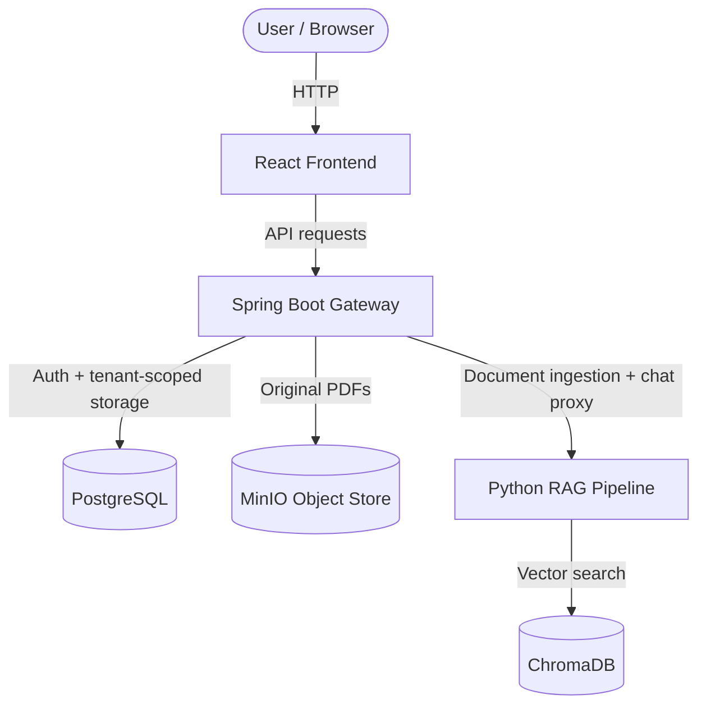

# DokuMind - Enterprise Intelligent Knowledge Management SaaS

**DokuMind** is a multi-tenant SaaS platform for secure document ingestion, document search, and grounded chat over company knowledge bases.

## System Architecture



### Services

1. [PlatformGateway](PlatformGateway/) - authentication, tenant resolution, user management, MinIO storage, and proxying to the RAG service.
2. [RAGPipeline](RAGPipeline/) - PDF parsing, chunking, vector storage, retrieval, reranking, and grounded text generation.
3. [FrontEnd](FrontEnd/) - role-based React UI for auth, users, documents, and chat.

## Quick Start

Run the full stack from the repository root:

```bash
cp .env.example .env
docker compose up --build
```

Docker Compose automatically reads `.env` from the repository root. Set the real values there before starting the stack:

* `POSTGRES_PASSWORD`
* `MINIO_ROOT_PASSWORD`
* `GROQ_API_KEY`
* `APPLICATION_SECRET_REFRESH_TOKEN`
* `APPLICATION_SECRET_ACCESS_TOKEN`
* `SPRING_MAIL_USERNAME`
* `SPRING_MAIL_PASSWORD`

The compose file wires the services together and uses those values at runtime.

### Local URLs

* Frontend: `http://localhost`
* Gateway: `http://localhost:8080`
* RAG API docs: `http://localhost:8001/docs`
* MinIO console: `http://localhost:9001`

## Manual Setup

If you do not want Docker, you need:

* Java 21
* Node.js 18+ or 22
* Python 3.11+
* PostgreSQL
* MinIO
* ChromaDB

### Gateway

Edit `PlatformGateway/src/main/resources/application.properties` or provide equivalent environment variables.

Required settings include:

* `spring.datasource.url`
* `spring.datasource.username`
* `spring.datasource.password`
* `minio.url`
* `minio.access.name`
* `minio.access.secret`
* `minio.bucket.name`
* `rag.pipeline.url`
* `application.secret.access_token`
* `application.secret.refresh_token`
* `application.expiration.access_token`
* `application.expiration.refresh_token`

### RAG Pipeline

```bash
cp RAGPipeline/.env.example RAGPipeline/.env
cd RAGPipeline
python3 -m venv venv
source venv/bin/activate
pip install -r requirements.txt
uvicorn main:app --host 0.0.0.0 --port 8000 --reload
```

Set `GROQ_API_KEY`, `GROQ_MODEL`, `CHROMA_HOST`, and `CHROMA_PORT` in `RAGPipeline/.env`.

### Frontend

```bash
cp FrontEnd/.env.example FrontEnd/.env
cd FrontEnd
npm install
npm run dev
```

Set `VITE_API_URL=http://localhost:8080` in `FrontEnd/.env`.
