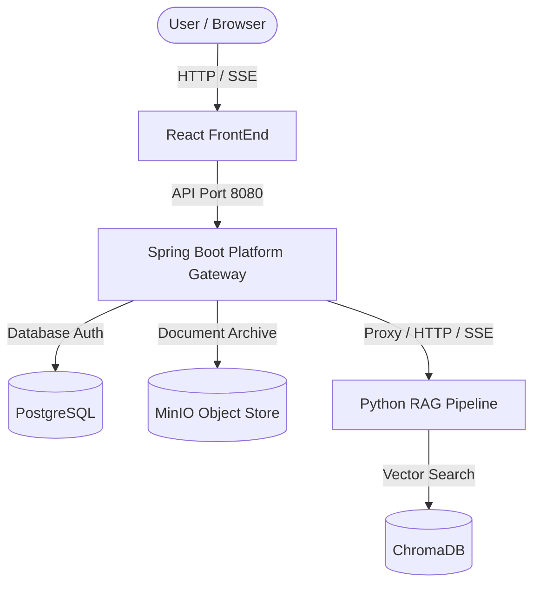

# DokuMind — Enterprise Intelligent Knowledge Management SaaS

**DokuMind** is a multi-tenant enterprise SaaS platform designed to act as an intelligent knowledge engine for organization documents. Users can securely upload PDF policies, guidelines, and manuals, and interact with them in real-time through an advanced Retrieval-Augmented Generation (RAG) chat pipeline. 

---

## 🏛️ System Architecture

DokuMind is built as a microservices architecture consisting of three primary modules:



### 1. [Platform Gateway](file:///home/eayzaid/Projects/DokuMind/PlatformGateway) (Spring Boot)
The secure gateway. It handles JWT authentication, User/Role Management (Admin, HR, Assistant, Worker), and stores original documents in **MinIO**. It resolves the active user's company (tenant) and proxies file ingestion and streaming chat queries to the RAG Pipeline securely.
👉 *See [Platform Gateway documentation](file:///home/eayzaid/Projects/DokuMind/PlatformGateway/README.md) for detailed APIs and configuration.*

### 2. [RAG Pipeline](file:///home/eayzaid/Projects/DokuMind/RAGPipeline) (FastAPI + LangChain)
The semantic search and generation service. Using **sentence-transformers**, it splits documents into parent-child chunks and indexes them in a tenant-isolated **ChromaDB** space. It leverages **Groq** LPUs for low-latency streaming chat response generation and incorporates MS-MARCO re-ranking and hallucination prevention guardrails.
👉 *See [RAG Pipeline documentation](file:///home/eayzaid/Projects/DokuMind/RAGPipeline/README.md) for retrieval logic and API details.*

### 3. [FrontEnd](file:///home/eayzaid/Projects/DokuMind/FrontEnd) (React + Vite + Tailwind CSS)
The modern web application UI. Renders dynamic dashboards matching the authenticated user's role: admin control panel, HR employee roster management, document tables, and real-time streaming chat feeds.
👉 *See [FrontEnd documentation](file:///home/eayzaid/Projects/DokuMind/FrontEnd/README.md) for UI structures and setup.*

---

## 🚀 Step-by-Step Getting Started Guide

You can run the entire stack instantly using Docker Compose, or run services manually.

### Method A: Fast Run via Docker Compose (Recommended)

Make sure you have **Docker** and **Docker Compose** installed.

1. **Clone the repository**:
   ```bash
   git clone https://github.com/eayzaid/DokuMind.git
   cd DokuMind
   ```

2. **Configure your API Keys**:
   Open [docker-compose.yml](file:///home/eayzaid/Projects/DokuMind/docker-compose.yml) and input your `GROQ_API_KEY` under the `ragpipeline` service environment:
   ```yaml
     ragpipeline:
       ...
       environment:
         GROQ_API_KEY: "your-groq-api-key-here"
   ```

3. **Start all services**:
   ```bash
   docker compose up --build
   ```

4. **Access the applications**:
   * **FrontEnd Web UI**: [http://localhost](http://localhost)
   * **Platform Gateway**: [http://localhost:8080](http://localhost:8080)
   * **RAG Pipeline (Swagger UI)**: [http://localhost:8001/docs](http://localhost:8001/docs)
   * **MinIO Console (Object Store)**: [http://localhost:9001](http://localhost:9001) (User: `admin` / Password: `adminpassword`)

---

### Method B: Manual Service Setup (Local Development)

If you prefer to run each service individually on your local system:

#### 1. RAG Pipeline Setup
Prerequisites: Python 3.10+, ChromaDB service running locally on port `8000`.
```bash
cd RAGPipeline
python3 -m venv venv
source venv/bin/activate
pip install -r requirements.txt
```
Create a `.env` file inside `RAGPipeline`:
```env
GROQ_API_KEY=your_key_here
GROQ_MODEL=llama-3.1-8b-instant
CHROMA_HOST=localhost
CHROMA_PORT=8000
```
Run the FastAPI application:
```bash
uvicorn main:app --port 8000 --reload
```

#### 2. Platform Gateway Setup
Prerequisites: Java 17+, PostgreSQL database running on port `5432`, MinIO running on port `9000`.
Ensure environment variables are set or configured in `PlatformGateway/src/main/resources/application.yml`.
Run the application:
```bash
cd PlatformGateway
./mvnw spring-boot:run
```

#### 3. FrontEnd Setup
Prerequisites: Node.js 18+.
```bash
cd FrontEnd
npm install
```
Create a `.env` in `FrontEnd`:
```env
VITE_API_URL=http://localhost:8080
```
Run the development server:
```bash
npm run dev
```
Open [http://localhost:5173](http://localhost:5173) in your browser.
